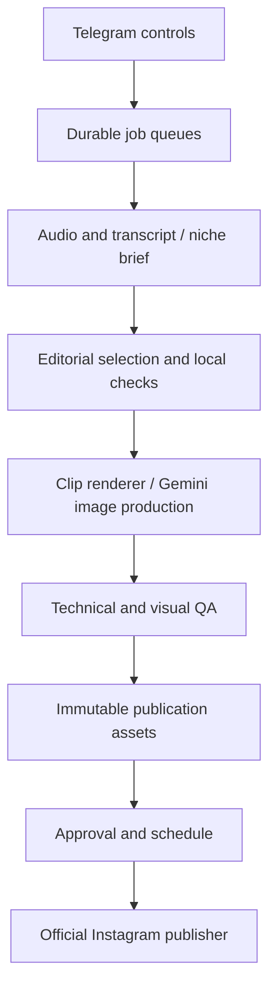

# CLIPER editorial research and product design

## Findings and evidence quality

The strongest product direction is to improve the substance and readability of every published item while making production recoverable. A clip needs a clear opening, enough context, an earned payoff and intelligible sound. A carousel needs a reason to keep swiping, an identifiable visual identity and something useful to retain. No public evidence establishes a universal combination of title, duration, effects or posting time that guarantees viral distribution.

This review uses evidence available on September 10, 2026. Platform statements explain distribution priorities, observational studies describe associations, and editorial recommendations translate those findings into testable production choices. These categories should not be confused. An LLM's score is not a calibrated probability of views, and a local image or audio check cannot measure audience response.

Meta reported in January 2026 that 75% of Instagram recommendations in the US came from original posts after changes in Q4 2025. Its earlier creator-distribution announcement described replacing matching reposts with originals and distinguishing substantially transformed material. These are reasons to prioritize original expression and meaningful editorial contribution. Adding a title, music or a crop alone does not establish that a repost will qualify as original. [1][2]

Instagram's professional-dashboard Best Practices hub provides guidance on attention, duration, engagement and reach, including account-specific tips. This matters because an account's actual audience is more informative than a generic timing chart. The hub is not evidence that one duration applies to every account. [3]

Buffer's 2026 report covers posts published through Buffer, not all Instagram activity. Its main data extends through December 3, 2025, while some format comparisons use January 2022–October 2024. It reports higher engagement per reach for carousels, while describing Reels as useful for discovery. Its methodology also notes changing metric definitions and account composition. Treat these as benchmarks and directional evidence, not causal promises. [4]

Socialinsider's updated benchmark page reports Q2 2026 engagement around 0.50% for carousels and 0.48% for Reels. Its figures must not be directly compared with reach-based engagement figures from another study: denominator, population, date window and aggregation differ. The practical interpretation is that both formats can serve a purpose; claiming one universally dominates would overstate the evidence. [5]

Berger and Milkman's research links sharing with factors including practical usefulness, surprise and emotionally activating content. The study concerned New York Times articles and experiments, not contemporary Instagram Reels. It supports investigating why someone would share an item, but does not justify manufacturing anger, anxiety or false claims to obtain reach. [6]

Some direct Instagram pages and videos were unavailable to the research browser. In particular, the original Mosseri video commonly cited for watch time, likes and sends could not be inspected directly. Those precise ranking claims are not treated here as newly verified primary evidence. The product instead uses observable editorial goals: clarity, complete stories, useful takeaways and truthful titles.

## Clip selection and duration

Duration should follow the story. The following ranges are editorial starting points, not statistically proven optimums:

| Range | Appropriate material | Common failure |
|---|---|---|
| 15–30 seconds | One useful insight, a concise reaction, a complete short exchange | Removing the context that makes the moment meaningful |
| 30–60 seconds | An explanation, example, reveal or compact story | Keeping greetings and repeated setup |
| 45–90 seconds | A story with necessary setup, development and resolution | Assuming a longer clip is more valuable simply because more is said |

For each candidate, ask what a stranger understands in the opening sentence, what question or tension sustains attention, and where the promise is fulfilled. Keep qualifications that change the meaning. Reject a striking sentence if the required setup lies outside the selected interval and cannot fit the chosen limits.

Avoid blanket rules such as cutting every pause or zooming every two seconds. A pause before a reveal can carry meaning; a pause caused by searching for a file usually does not. Automatic detection can flag intervals, but deciding whether an internal pause is expendable requires context. The current implementation trims only bounded silent edges using word timing. It does not rearrange speech or silently remove internal dialogue.

CLIPER now records first-word delay, trailing gap, speech rate, long word-timing gaps, repeated phrases and transcription-confidence concerns. The checks are explainable and saved with the clip. They are not labelled retention predictions. Low confidence and suspicious repetition require editorial review before automatic publication.

Speech rate is a reading and comprehension concern, not a quality score on its own. A fast comic exchange and a dense technical explanation place different demands on viewers. Keep the original delivery; adjust caption grouping and selection rather than accelerating every speaker. Timed captions retain phrases through short gaps, reducing visual flicker while preserving the actual words.

## Hook titles

A spoken hook, an on-screen title and a caption have different jobs. The spoken hook is actual source dialogue. The title helps a stranger understand why the moment matters. The Instagram caption adds context or a useful invitation without reproducing an entire transcript.

The title starting point is 4–10 words and preferably no more than 65 characters. Those limits are mobile-layout choices. They are not Instagram ranking thresholds. Short titles allow a useful font size and reduce the time needed to understand the premise. Necessary names, qualifications and source-language meaning take precedence over forcing a template.

| Weak approach | Better original example | Required evidence |
|---|---|---|
| “You won't believe this” | “The moment they announce the winner” | The clip contains the announcement and reaction |
| A long event summary | “Why his first launch failed” | The speaker actually explains the failure |
| “This habit guarantees success” | “Make starting easier than scrolling” | The post offers an experiment rather than a guarantee |
| An unsupported numerical promise | “Test demand before building” | The clip explains testing demand |

These examples demonstrate structure, not text to stamp onto unrelated videos. CLIPER requests direct-value, curiosity and contrast variants. Local checks penalize dense generic titles and reject numbers absent from the source. The Telegram shortlist allows hook review and selection before rendering. A chosen title still needs to match the actual story; lexical checks do not establish factual truth.

## Editing, sound and framing

The requested default remains a 1080×1920 black canvas with a 1:1 video window and a white title above it. This is a recognizable layout choice, not a claim that black borders improve reach. Full-height layouts remain available through the legacy renderer, and the strongest layout should eventually be compared using the account's own results.

A square center crop can remove people near the edge. Smart framing now samples faces and follows their horizontal location. The default keeps a filled 1:1 crop as specified. The optional Fit wide groups setting preserves the full frame within the square window when a detected group is too wide; it introduces letterboxing inside that window. The detector is conservative face detection, not speaker diarization, identity recognition or a guarantee that every face is detected. Poor lighting, profiles, animation and occlusion remain limitations.

Captions should be readable without covering the important action. BBC accessibility research shows that device size and viewer preference affect subtitle size; it does not provide an Instagram-specific universal font size. CLIPER uses bounded phrase groups, sentence breaks and stationary word highlighting. Its defaults should still be inspected on an actual phone. [7]

Music remains at the requested 20% input gain. Optional sidechain compression lowers it further during speech, while brief fades soften the edges. This is implemented with documented FFmpeg audio filters; it improves control of the mix but cannot make poor source speech clean. Loudness normalization and limiting are separate from intelligibility. [8]

The quality pipeline now decodes the complete export rather than calling a short sample a full decode. It separately samples the actual video window for black intervals and nearly static sequences, excluding the intentional outer black canvas. Static images and fades may be intentional, so these are review signals rather than reasons to manufacture motion. A cover preview is saved from an early, non-black frame selected by a sharpness heuristic; it is not automatically uploaded as an Instagram custom cover.

## Faceless content and niche identity

Public creator material suggests several useful content archetypes. Visualize Value maintains a catalog of concept-led visual work. The Brain Coach's own public links emphasize practical exercises and workbooks. The Rundown's public workflow hub emphasizes concrete tasks and applications. These are format references, not independently verified examples of particular posts going viral. Their artwork, voice and claims should not be copied. [9][10][11]

The product uses five separate editorial directions:

| Niche | Useful recurring formats | Narrative and visual direction |
|---|---|---|
| Dark self-improvement | Habit-friction experiment, time trade-off, mistake and alternative | Isolation to deliberate action; charcoal and restrained warm light; agency without intimidation |
| Men's self-improvement | Communication before/after, habit checklist, confidence through practice | Uncertainty to useful practice; respectful competence rather than dominance clichés |
| Money psychology | Spending decision tree, illustrative opportunity cost, habit experiment | Temptation to trade-off to deliberate choice; arithmetic labelled and checked |
| Technology and AI | Concept explanation, workflow checklist, capability versus limitation | Confusion to understandable mechanism to application; no invented product capabilities |
| Finance and business | Risk comparison, business mechanism, illustrative cash-flow example | Decision to trade-off to general principle; no return promises or stock recommendations |

The new prompts supply these directions without replacing the locally configured character images. Identity comes from a consistent character, palette, type hierarchy, framing and tone. A new pose and environment should serve the story beat. Repeating the same hero pose on every slide creates superficial consistency while weakening the narrative.

## Carousel structure and image prompting

A strong cover names a specific tension or payoff. The second slide should make sense as another entry point while advancing the premise. Middle slides supply examples, steps or a useful comparison. The final slide resolves the idea and suggests one relevant action. A carousel consisting only of escalating slogans offers little reason to save it.

The default remains 4–7 slides. Cover text is preferably 4–12 words, body text usually 8–25. Local checks reject covers above 16 words and body slides above 40 words before image generation. These are production limits chosen to support legibility. They are not claimed to be optimal for every carousel or language.

A complete image prompt now includes the attached character's role, the full narrative context, the current slide number, exact text, environment, action, camera, lighting, mood, palette, typography and reserved overlay area. It explicitly tells Gemini not to print prompt instructions, metadata or text from the other slides. Typography is kept away from the character's face and hands and out of visually busy regions.

Gemini supplies the finished artwork and typography. FFmpeg performs fitting and the swipe overlay. Local checks detect flat-color images and near-duplicates of the reference or earlier slides. Gemini is asked to transcribe the text it actually sees; Python compares that transcription against the intended words, including numbers and negations. The comparison is deterministic, but the transcription still depends on Gemini's visual reading. This is not an independent OCR engine or a guarantee of perfect spelling.

A rejected plan gets one revision and another review before any images are generated. A rejected slide gets one regeneration with specific feedback. Login, network and account-limit failures do not trigger unbounded generation. If defects remain, production stops with its successful intermediate work preserved.

## Research and factual claims in production

The research performed for this report is broader than the bot's runtime RSS discovery. Runtime feeds currently supply headlines and links for inspiration; they do not prove the contents of linked studies. The prompts therefore prefer evergreen explanations and clearly illustrative examples when verified evidence is not available.

Arithmetic validation accepts bounded real-number expressions and checks supplied results. It rejects complex or excessively large intermediate values. It does not prove that a starting assumption, percentage or financial scenario is true. A correct calculation can still rest on an unsupported premise.

Claims about diagnosis, current AI product capabilities, financial returns or scientific research should not be generated from headline fragments. The local plan check catches some research-attribution language without sources, while the AI review handles broader context. The system is not a comprehensive fact checker; genuinely current factual posts still need source-level review.

## Architecture and reliability

The implementation separates editorial policy, local checks, media processing, browser adapters, publication state and user controls:

Several audit findings had direct operational consequences:

| Finding | Correction |
|---|---|
| A short decode sample was labelled full decode | Decode the complete file and report sampled visual checks separately |
| Render reuse checked preferences but not the actual clip | Versioned identity includes clip, transcript, source identity, encoder and music inventory |
| Background deliveries could survive a render failure | One ordered upload overlaps rendering; owned tasks are cancelled and awaited on failure |
| Skipped image QA was stored as successful booleans | Record `skipped`, and require manual approval |
| Image checks accepted a uniform colored frame | Test luminance variation rather than variation between color channels |
| Reference-image rejection behaved differently in tests | Remove the test-only bypass and use genuinely distinct fixtures |
| Source or staged media could change after approval | Save and compare SHA-256 asset hashes; stage files atomically |
| Rejecting one scheduled post blocked later posts forever | Follow past rejected predecessors while retaining spacing from the last successful post |
| Audio extraction allowed a combined-video fallback | Require the audio-only format again |
| Failed range extraction could leave an old playable range | Remove mismatched generated range outputs before extraction |
| Cached carousel QA ignored some design changes | Include brand, full plan, position, reference and QA mode in its identity |

Instagram publishing continues to use official media-container and publishing endpoints, with professional-account configuration supplied locally. The publisher persists the boundary around the final publish request and preserves ambiguous outcomes for inspection rather than blindly resending. This remains essential because a network timeout cannot prove that Instagram did not publish. [12]

The NVIDIA configuration remains local CUDA transcription and NVENC encoding. Word confidence is now retained, and beam size defaults to five with a configurable `WHISPER_BEAM_SIZE`. The faster-whisper project documents word timestamps, beam-search configuration and quantized GPU operation. These settings involve speed/quality trade-offs; its published benchmarks are not measurements of this machine. [13]

## Evaluation and remaining limits

### Additional route: clipping using Gemini

Google documents asking Gemini about YouTube content. The additional route sends a public video link directly to the saved Gemini website session and requests structured moments, transcripts and caption timings. It obtains source metadata without downloading streams, then downloads only the selected sections. Google’s help does not establish reliable word alignment or universal video access. Local validation rejects impossible or inconsistent JSON, and the default selected-range Whisper pass corrects captions from actual speech. The faster unverified-caption option requires publication review. This feature has no Gemini API-key requirement, but remains subject to website availability and account limits. [14]

The first evaluation layer is deterministic: valid timestamps, complete decode, bounded output size, measurable audio, cache invalidation, ownership, state transitions, asset integrity and correct image dimensions. The next layer is editorial: title truthfulness, intelligibility, context, complete payoff, useful slide progression and readable design. Only actual audience data can evaluate distribution performance.

For a future account experiment, compare like-for-like topics across short, medium and longer durations. Change one main variable at a time, label the hook and format, and compare medians rather than celebrating a single outlier. Review watch time, sharing and saving relative to reach where available, alongside the qualitative response. Do not call an uncontrolled posting comparison a randomized experiment.

Analytics and self-learning remain outside the earlier v1 scope. No automated comment spam, purchased engagement or fabricated performance signals have been added. A future analytics module should distinguish organic and paid results, keep metric definitions with each observation and avoid treating missing values as zero.

Website sessions, account limits, changing UI, undetected image defects and source quality remain real dependencies. The changes improve the production system and make failure more visible; they do not establish a “number one” product ranking or guarantee viral posts.

## Sources

1. Meta. [2026: AI Drives Performance](https://about.fb.com/news/2026/01/2026-ai-drives-performance/). January 28–29, 2026. Official report on Q4 2025 recommendation changes.
2. Meta. [Ajudando o criador de conteúdo a encontrar novos públicos](https://about.fb.com/br/news/2024/04/ajudando-o-criador-de-conteudo-a-encontrar-novos-publicos/). April 30, 2024. Official Portuguese edition of creator/originality announcement.
3. Meta. [Introducing Best Practices, an Education Hub for Creators on Instagram](https://about.fb.com/news/2024/10/best-practices-education-hub-creators-instagram/). October 1, 2024.
4. Tamilore Oladipo / Buffer. [The State of Social Media Engagement in 2026](https://buffer.com/resources/state-of-social-media-engagement-2026/). March 5, 2026. Observational platform study; mixed analysis windows disclosed in methodology.
5. Socialinsider. [2026 Instagram Organic Engagement Benchmarks](https://www.socialinsider.io/social-media-benchmarks/instagram). Updated with Q2 2026 observations; accessed September 10, 2026.
6. Jonah Berger and Katherine L. Milkman. [What Makes Online Content Viral?](https://faculty.wharton.upenn.edu/wp-content/uploads/2011/11/Virality.pdf). Journal of Marketing Research, 2012; author-hosted manuscript.
7. Ed White and Nigel Megitt / BBC. [How Big Should Subtitles Be?](https://bbc.github.io/gaad/how_big_should_subtitles_be/index.html). May 16, 2019. Accessibility research presentation; not Instagram-specific.
8. FFmpeg. [Filters Documentation](https://ffmpeg.org/ffmpeg-filters.html). Sections on loudnorm, sidechaincompress, afade and video filters; accessed September 10, 2026.
9. Visualize Value. [Visuals archive](https://www.visualizevalue.com/visuals). Creator-owned format reference; accessed September 10, 2026. No post-level performance attribution.
10. Nawal Mustafa. [The Brain Coach public links](https://linktr.ee/Thebraincoach). Creator-owned exercises, workbook and newsletter catalog; accessed September 10, 2026. No medical recommendations derived.
11. The Rundown. [AI Workflow Hub](https://app.therundown.ai/community?tag=newsletterdigest). Publisher-owned format reference; accessed September 10, 2026. Individual community assertions are not treated as verified facts.
12. Meta. [Instagram API documentation](https://www.postman.com/meta/instagram/documentation/6yqw8pt/instagram-api). Official Postman collection; accessed September 10, 2026.
13. SYSTRAN. [faster-whisper documentation](https://github.com/SYSTRAN/faster-whisper). Primary repository; accessed September 10, 2026.
14. Google. [Find and ask about YouTube content in Gemini Apps](https://support.google.com/gemini/answer/16622858?hl=en). Official Gemini Apps Help; accessed September 10, 2026.
